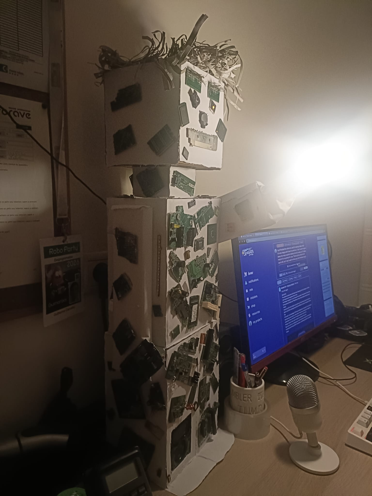
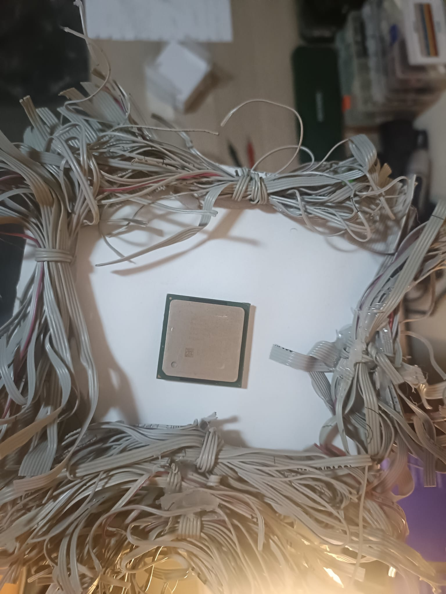
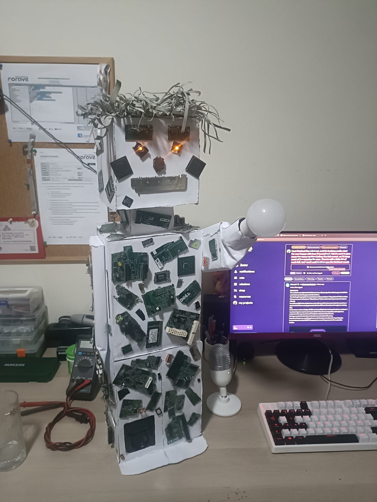
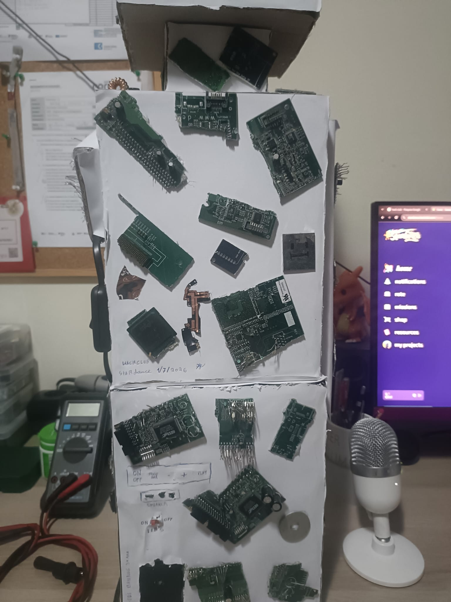
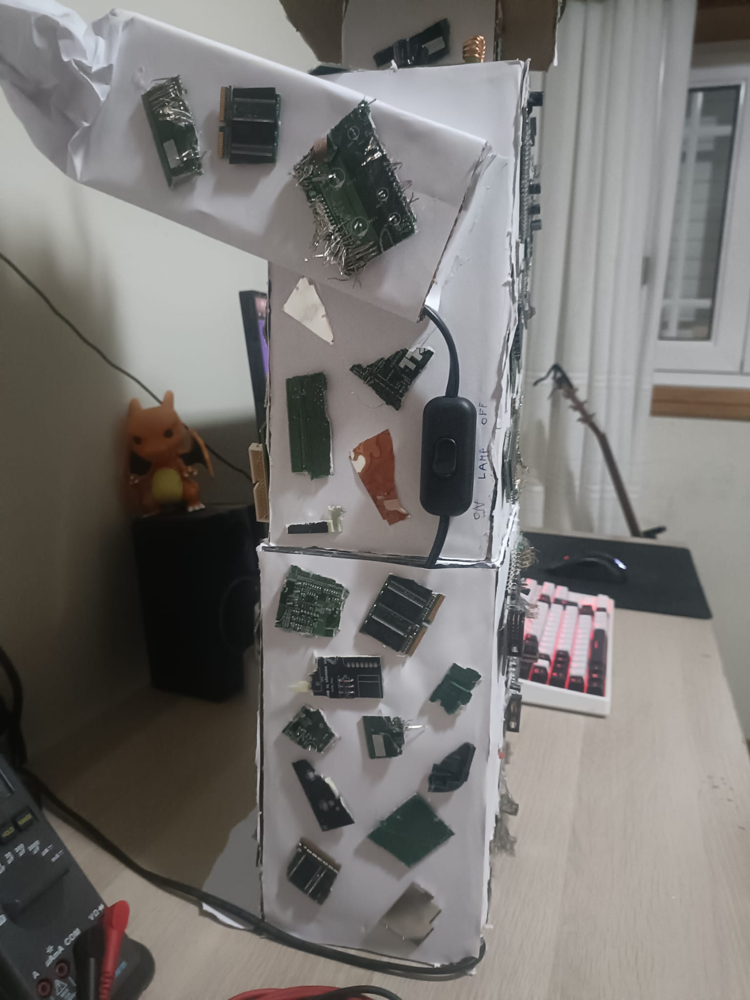
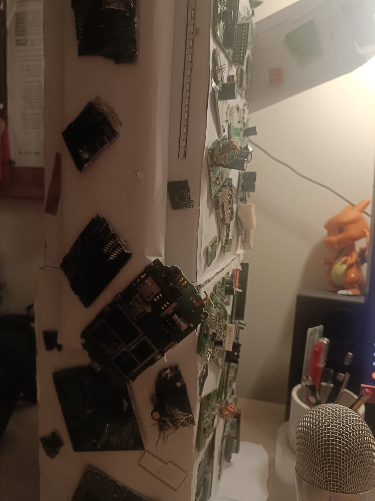

# STARDANCE — An E-Waste Robot Sculpture

## Demo 

<video src="https://github.com/Guils09/stardance-E-waste-Robot/raw/main/demo.mp4" controls width="600"></video>

## What I Learned
This was my first time turning old, dead electronics into something functional and expressive instead of just scrap. The biggest lessons: how much can genuinely be salvaged from devices most people would toss straight in the bin, how satisfying it is to repair a component (like the JBL speaker) rather than replace it, and how much planning goes into wiring something safely when you're mixing low-voltage LEDs with 230V AC in the same build. It also pushed my soldering, basic circuit-testing, and cable management skills a lot further than I expected going in. Most important takeaway: e-waste isn't waste — it's raw material.

This robot sculpture was made entirely from e-waste that would have otherwise been thrown away. Cardboard boxes form the head and torso, left hollow so wiring could run through the inside.

## The Head

The head is my favorite part. It has a piece of cellphone camera glass and a piece of a motherboard with working LEDs behind them as the eyes, a 3.3V battery as the nose, pins for the teeth, ribbon cables for the hair, and a CPU mounted on top of the head. The ribbon cables give it a messy look that makes the robot feel more alive.

## The Body

On the chest, I placed a CPU as the heart and another chip as the lungs. Behind the front panel are working controls, including an on/off switch, a search button, volume buttons, a play button, a built-in speaker, and a separate switch for the LEDs. The LEDs are powered by three AAA batteries, while the lamp uses 230V AC power. The built-in speaker, which I repaired from a JBL, can also play music.

## The Hand

The robot is holding a real cellphone motherboard in one hand, as if it is offering it to the viewer. With the camera glass and the phone motherboard, I wanted this to represent how important phones have become in our everyday lives. At the end of the other arm, I added a lightbulb to represent ideas and innovation.

## All Components

Every circuit board, chip, cable, and electronic part came from old devices that were going to be thrown away. Nothing was bought new. My goal was to show that electronic waste can be reused to create something meaningful instead of ending up as rubbish — and as a bonus, I ended up with a cool new desk lamp out of it too.

After putting everything together, I connected the lamp wiring, labeled the controls by hand, tested all the electronics with a multimeter, and signed the back: **STARDANCE – 1/7/2026**.

## Materials

- Cardboard
- Old trash pc´s
- An old cell phone 
- LEDs + 3x AAA batteries
- A repaired JBL speaker
- A lightbulb (230V AC)

